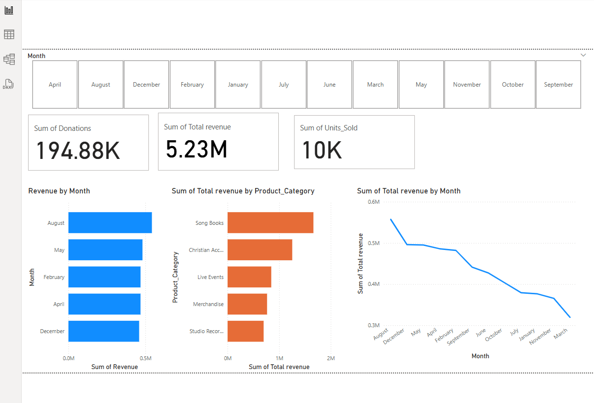

# SQL + Power BI Financial Analytics Project for a Music Company

# 🎵 Symphony Gospel Analytics Project

This project uses **SQL** and **Power BI** to analyze sales, donations, and inventory trends for a fictional gospel music company operating across Telangana and Andhra Pradesh.

## 🧰 Tools Used
- SQL (MySQL)
- Power BI
- Python (optional future extension)
- Excel (for raw data preparation)

## 📊 Key Features
- Total revenue & donations KPIs
- Sales trends by product category & channel
- Inventory and stock imbalance analysis
- Location-based performance dashboards

## 🧠 Skills Demonstrated
- ETL pipeline simulation
- Relational database design with joins
- DAX calculations in Power BI
- Real-time filtering & dashboard storytelling

## 📂 Project Structure
- `/data`: Raw CSV files
- `/sql`: Queries to create and populate tables
- `/powerbi`: Dashboard file (`.pbix`)
- `/images`: Screenshots of visuals

## 📸 Sample Dashboard

## 📬 Contact

**Samuel Sugeeth Adivikatla**  
Business Analyst | Data Enthusiast  

